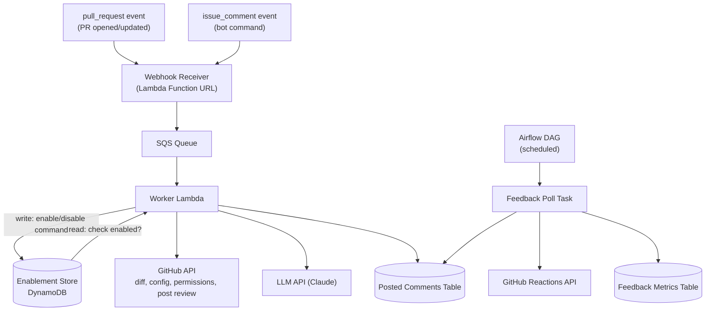

# Bob the Fixer

An AI-powered GitHub PR reviewer that catches repetitive, low-judgment issues — missing null checks, inconsistent error handling, obvious security gaps, style deviations — before a human reviewer gets to the PR. Bob supplements human review; it doesn't approve or block merges.

## Why

Reviewer time is spent on issues that don't need human judgment, which slows down turnaround and makes review quality inconsistent across teams. Bob gives every team a self-service first-pass reviewer, using standards that team defines, without needing a central platform team to configure or maintain it per repo.

## How it works

- Install the GitHub App once per org; each team opts in per repo via a bot command (`@bob-the-fixer enable`) — not on by default.
- A per-repo YAML config controls what Bob checks for: focus areas, ignored paths, custom instructions.
- On `pull_request` events, Bob fetches the diff, runs it through an LLM, and posts inline, line-level comments on the relevant diff lines.
- 👍/👎 reactions on Bob's comments are polled periodically to measure usefulness.



## Bot commands

Issued as PR/issue comments, require `write` access on the target repo:

- `@bob-the-fixer enable`
- `@bob-the-fixer disable`
- `@bob-the-fixer status`

## Config file (per repo)

```yaml
review_focus:
  - security
  - bugs
  - performance
ignore_paths:
  - "*.lock"
  - "vendor/**"
custom_instructions: |
  Flag missing null checks on API responses.
severity_threshold: warning
```

## Status

v1 scope — not yet enabled by default anywhere. See docs below for full details and open questions.

## Docs

- [PRD](./PRD.md) — problem statement, goals, scope, success metrics
- [Tech Design](./TECH_DESIGN.md) — architecture, components, data model
