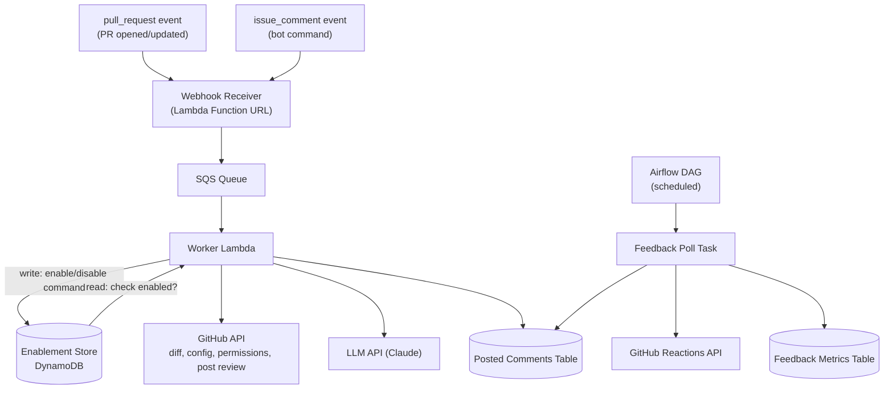

# Bob the Fixer — Architecture & Data Model

AI-powered GitHub PR reviewer, installable across teams/orgs. Reviews are opt-in per repo, configurable per repo, and instrumented for feedback.

## Architecture



## Event Triggers

Two independent GitHub webhook event types feed the same pipeline — one doesn't depend on the other:

| Event | Fires when | Worker action |
|---|---|---|
| `pull_request` | PR opened or updated | Read Enablement Store → if enabled, review |
| `issue_comment` | Any comment on a PR or issue, matching `@bob-the-fixer <command>` | Check commenter's write access via GitHub API → write Enablement Store |

**How the workflow runs**: both event types arrive at the same Receiver and flow through the same queue and Worker. The Worker inspects the event type first — a `pull_request` event triggers a read against the Enablement Store, and only proceeds to fetch the diff and call the LLM if that repo is enabled. An `issue_comment` event is checked against the bot command pattern; if it matches, the Worker verifies the commenter has write access on the repo, then writes the new enabled/disabled state. Neither path blocks the other — a repo can be enabled at any time independent of whether a PR is currently open.

## Components

| Component | Responsibility |
|---|---|
| **GitHub App** | Installed by teams; scoped permissions (PRs, contents, checks); installed broadly across an org's repos |
| **Webhook Receiver** | Verifies signature, pushes event to SQS, responds within GitHub's 10s window |
| **SQS Queue** | Buffers events between receipt and processing |
| **Worker Lambda** | Exchanges JWT → installation token; branches on event type: PR review, or `enable`/`disable`/`status` command. For reviews, maps LLM findings to diff positions (file + hunk offset) before posting inline comments |
| **Enablement Store** | Per-repo on/off flag, since repos are installed broadly but reviewed only when explicitly enabled |
| **Posted Comments Table** | Records every comment Bob posts, so feedback can be polled later |
| **Feedback Poll Task (Airflow)** | Scheduled DAG task; checks reaction counts on Bob's own recent comments |
| **Feedback Metrics Table** | Stores 👍/👎 counts per comment, the core quality signal |

## Data Model

### Enablement Store

| Field | Type | Notes |
|---|---|---|
| `repo_id` | string (PK) | GitHub repo ID |
| `enabled` | boolean | Default `false` — opt-in only |
| `enabled_by` | string | GitHub username who ran `enable` |
| `enabled_at` | timestamp | |
| `disabled_at` | timestamp, nullable | Set when disabled |

### Posted Comments Table

Bob posts one review per PR containing multiple inline comments — each line-level comment gets its own row, grouped by `review_id`.

| Field | Type | Notes |
|---|---|---|
| `comment_id` | string (PK) | GitHub comment ID, returned on post |
| `review_id` | string | Groups all inline comments from one review call |
| `repo_id` | string | |
| `pr_number` | int | |
| `file_path` | string | File the comment is anchored to |
| `line` | int | Line number the comment is anchored to |
| `posted_at` | timestamp | |
| `last_checked_at` | timestamp, nullable | Set by the feedback poll job |

### Feedback Metrics Table

| Field | Type | Notes |
|---|---|---|
| `comment_id` | string (PK) | Joins to Posted Comments |
| `repo_id` | string | |
| `pr_number` | int | |
| `thumbs_up` | int | Snapshot count, not a delta |
| `thumbs_down` | int | Snapshot count, not a delta |
| `checked_at` | timestamp | Last time this row was refreshed |

Reactions API returns a current total each call — polling overwrites `thumbs_up`/`thumbs_down`, no incremental math needed.

## Config File (per repo)

Controls review instructions only — not enablement.

```yaml
review_focus:
  - security
  - bugs
  - performance
ignore_paths:
  - "*.lock"
  - "vendor/**"
custom_instructions: |
  Flag missing null checks on API responses.
severity_threshold: warning
```

## Bot Commands

Issued as PR/issue comments; require `write` access on the target repo (checked via GitHub's collaborator-permission API before acting):

- `@bob-the-fixer enable`
- `@bob-the-fixer disable`
- `@bob-the-fixer status`

## Notes / Future Work

- The `enable`/`disable` write is a simple, fast operation (unlike the LLM review call) — the Receiver could handle it synchronously and skip SQS entirely, avoiding queue latency for something users expect to feel instant. Only `pull_request` events strictly need the queue, since only that path has a slow LLM call to buffer against.
- Inline comments require mapping LLM findings (file + line) to GitHub's diff "position" (offset within the unified diff hunk, not the absolute file line) — GitHub's Review API rejects positions outside the diff's visible hunks. A finding on such a line is dropped rather than surfaced elsewhere; prompt design should constrain the LLM to only flag lines actually present in the diff, validated during testing against real PR shapes.
- Feedback poll window (e.g. only recheck comments < 14 days old) — avoid wasted API calls on stale comments.
- Aggregate views (acted-upon rate, per-repo adoption) can be computed on top of the tables above rather than stored separately.
- Config file validation should fail safe (skip review, log) rather than fail loud.
